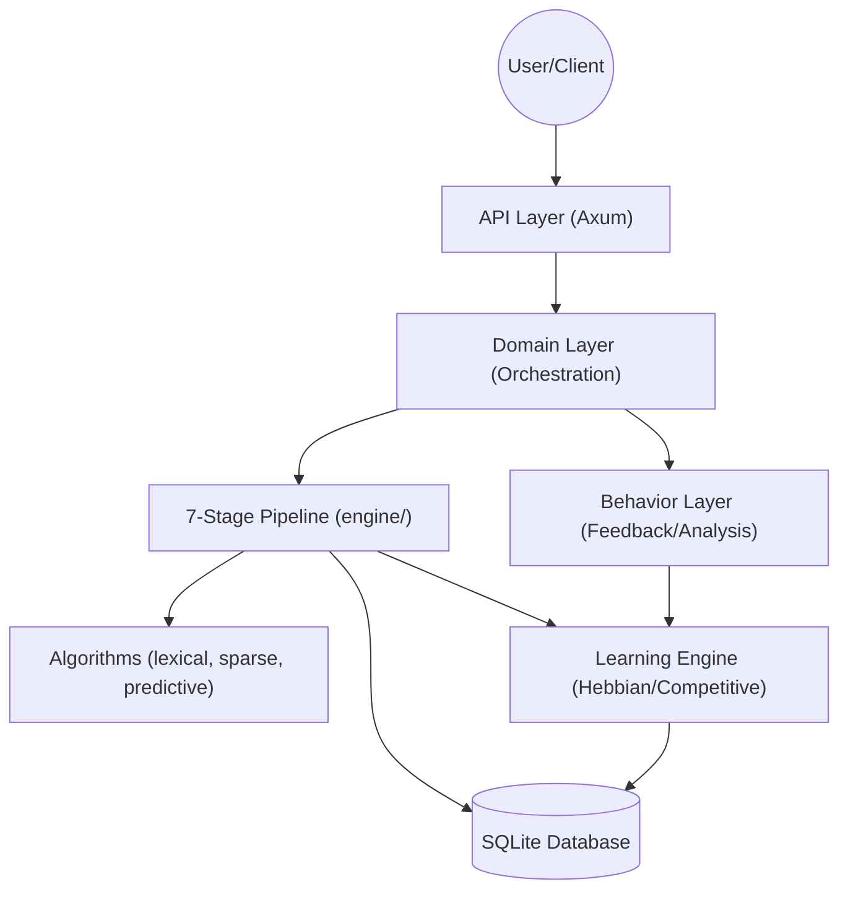

# Token Compress Engine Architecture

## Project Identity

```
Project  : token_compress_engine
Stack    : Rust | Axum | SQLite
Scale    : Monolithic service, designed for millions of records
Owner    : navinvaddey
Last updated : 2026-03-29 by kilo/nvidia/nemotron-3-super-120b-a12b:free
```

## Architecture Overview
> **Scale Contract (GAP-15):** The engine currently utilizes SQLite in WAL mode with a busy timeout. This architecture has a strict write-concurrency ceiling. **If concurrent active sessions exceed 100K, SQLite is mathematically disqualified as the storage layer.** At that scale threshold, the system must migrate to PostgreSQL (or TiKV for write-heavy paths) and introduce an in-memory staging cache (e.g., `moka` or Redis) to decouple read paths from the append-only logs.

The Token Compress Engine is a monolithic Rust application built with the Axum web framework and backed by SQLite. It implements a high-fidelity, 7-stage token compression pipeline designed to optimize prompt efficiency through adaptive learning, structural analysis, and continuous feedback loops.

### High-Level Component Diagram


### The 7-Stage Compression Pipeline
The core of the engine is a strictly sequenced 7-stage pipeline (0A through 6B) as specified in the Refinements Guide:


### Directory Structure

```
src/
├── api/              # HTTP controllers and route definitions
├── data/             # Database access layer (repositories)
├── domain/           # Business logic and use cases
├── engine/           # Core compression algorithms and learning engine
├── behavior/         # User behavior analysis and feedback processing
├── models/           # Data models and database schema
├── algorithms/       # Specific compression algorithm implementations
├── pipeline/         # Data processing pipeline orchestration
├── session/          # User session management
├── types.rs          # Shared types and constants
└── lib.rs            # Library exports and shared state (AppState)
```

## Component Details

### 1. API Layer (`src/api/`)
Handles HTTP requests and responses, routing, and middleware.
- Defines API endpoints using Axum
- Handles request validation and response formatting
- Contains authentication and authorization logic

### 2. Data Layer (`src/data/`)
Database access layer implementing the repository pattern.
- Contains database connection and query logic
- Implements CRUD operations for all entities
- Uses SQLx for database interactions

### 3. Domain Layer (`src/domain/`)
Contains business logic and application use cases.
- Orchestrates data flow between repositories and engines
- Implements core application logic (user registration, compression, etc.)
- Coordinates with the learning engine for adaptive behavior

### 4. Engine Layer (`src/engine/`)
Implements the core token compression algorithms and learning capabilities.
- **LearningEngine**: Integrates Hebbian and Competitive learning for adaptive modeling.
- **PipelineOrchestrator**: Manages the strict 7-stage compression flow and data routing.
- **Dual-Scoring**: Calculates Task-Essential (TES) and Schema Fidelity (SFS) scores.
- **Evaluation**: Quantifies lexical overlap, semantic similarity, and fact recall.

### 5. Behavior Layer (`src/behavior/`)
Analyzes user behavior and feedback to improve compression effectiveness.
- **FeedbackDetector**: Captures explicit (thumbs up/down) and implicit signals.
- **Adaptive Tuning**: Triggers learning updates based on user interaction success.

### 6. Models Layer (`src/models/`)
Defines the strictly enforced domain models and schema definitions.
- **Entity Definitions**: User, TokenHistory, FeedbackSignal, UseCase, etc.
- **Version Tracking**: Maintains version history for use-case prompt frames.

### 7. Algorithms Layer (`src/algorithms/`)
The specialized components used within the pipeline stages.
- **Language Analysis**: Lexical compression and phrase-aware sparse coding.
- **Cognitive Modeling**: Working memory slots, predictive coding, and topology classification.
- **Structural Tools**: Schema filling, field type validation, and scope injection.

### 8. Pipeline Layer (`src/pipeline/`)
Orchestrates the sequence of execution for all compression stages.
- **Stage Management**: Individual modules (Stage 0 through 6) that perform atomic operations.
- **Data Continuity**: Maintains the `AlgorithmOutput` state across the pipeline.

### 9. Scoring & Analytics Layer (`src/scoring/` & Admin)
New high-fidelity monitoring and performance calibration system.
- **Dual-Score Logic**: 0-10 scaled scoring for TES (Efficiency) and SFS (Fidelity).
- **Admin Dashboard**: Real-time monitoring of system throughput, cluster hits, and error metrics.

## Data Flow

## Detailed Pipeline Stages

The orchestration of `PipelineInput` to `CompressionResponse` follows a refined 7-stage process:

1.  **Stage 0A/0B: Normalization & Topology**: Corrects typos against `DOMAIN_VOCAB` and classifies the prompt structure (e.g., "Instructional", "Creative", "Data-Heavy") to set processing priors.
2.  **Stage 1: Signal Reduction**: Performs lexical compression and phrase-aware sparse coding to remove redundant tokens while preserving domain-specific terminology.
3.  **Stage 2: Boundary Detection**: Uses predictive coding and `SessionHistory` to decide between "Gentle", "Balanced", and "Aggressive" modes based on entropy thresholds.
4.  **Stage 3: Context Management**: Leverages Hebbian-derived working memory slots to ensure high-priority context is protected during high-ratio compression.
5.  **Stage 4/4B: Schema Filling & Validation**: Infers roles, fills missing task fields, and validates the resulting schema (deliverables, constraints) for structural integrity.
6.  **Stage 5: Scope Injection**: For "Aggressive" mode, injects deterministic scope suggestions to guide the model towards efficient execution.
7.  **Stage 6A/6B: Generation & Correction**: Generates the final optimized prompt. If the calculated Dual-Score (TES/SFS) falls below 6.0, an auto-correction cycle is triggered.

## Scoring & Monitoring

### Dual-Scoring System
The engine evaluates every compression using two primary metrics, mapped to a 0-10 scale:
- **Task-Essential Score (TES)**: Measures token efficiency and the preservation of critical task instructions.
- **Schema Fidelity Score (SFS)**: Measures how well the output adheres to the expected structural requirements and constraints.

### Admin Monitoring
The administrative dashboard provides real-time visibility into:
- **System Performance**: p99 latency and throughput.
- **Cluster Distribution**: Visual mapping of learned user domains and cluster "hits".
- **Feedback Analysis**: Correlation between algorithm modes and user thumbs-up/down signals.

## Data Flow

1. **Request Handling**: HTTP requests arrive at the API layer.
2. **Session Identification**: System retrieves `SessionHistory` for context-aware mode decisions.
3. **Pipeline Execution**: The `PipelineOrchestrator` runs stages 0A through 6B.
4. **Learning Update**: Regardless of the outcome, the session-wide schema is updated, and results are fed back into the Learning Engine.
5. **Analytics Logging**: Detailed metrics are recorded for administrator monitoring.
6. **Response**: The optimized prompt is returned along with detailed fidelity metadata.

## Configuration

- Environment variables loaded via `dotenvy`
- Database connection configured through `DATABASE_URL`
- Admin credentials set via `ADMIN_PASSWORD`
- Logging configured with `tracing` and `tracing-subscriber`

## Change Log (Architectural Changes)

```
[2026-03-29] [Model: kilo/nvidia/nemotron-3-super-120b-a12b:free] [File: ARCHITECTURE.md]
What changed : Created initial architecture documentation with component diagrams and details
Why          : Provide clear architectural overview for development and maintenance
Impact       : Establishes baseline for tracking future architectural decisions

[2026-04-02] [Model: Antigravity] [File: ARCHITECTURE.md]
What changed : Updated to 7-stage pipeline architecture (Stages 0A-6B), added Mermaid diagrams, and documented the Dual-Scoring (TES/SFS) and Admin Monitoring systems.
Why          : Reflect the major architectural refactoring and modernization of the engine to meet the high-fidelity refinement specs.
Impact       : ARCHITECTURE.md now serve as a ground-truth document for the current high-complexity state of the engine.
```