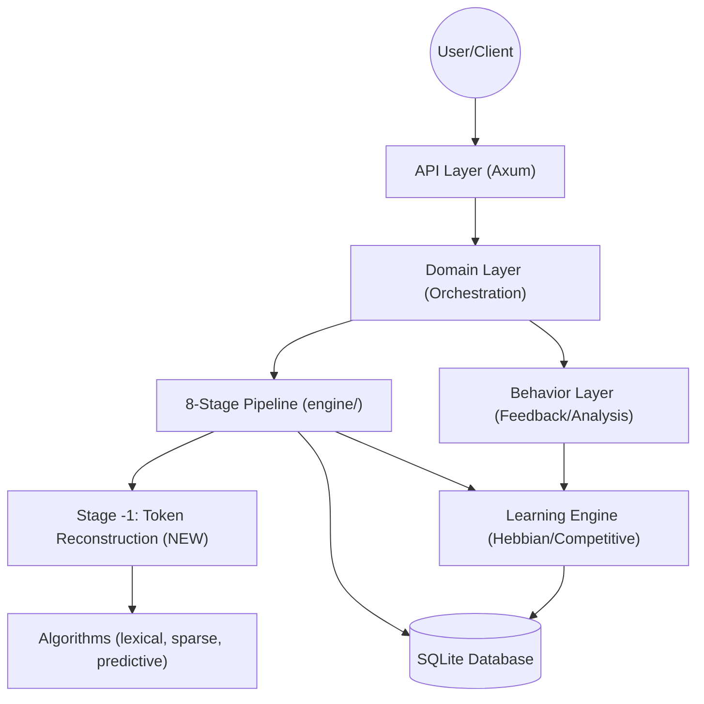

# token_compress_engine — Architecture v2

```
Project   : token_compress_engine
Stack     : Rust | Axum | SQLite → PostgreSQL (GAP-15 migration path)
Scale     : Monolithic service, designed for millions of records
Owner     : navinvaddey
Version   : 2.0.0
Last updated : 2026-04-14
Status    : v2 Spec — Drafted from failure analysis of v1 pipeline
```

---

## What Changed From v1 — and Why

v1 was designed for **degraded sentences** — inputs that have structure but contain noise.
The production failure exposed a harder problem: **unordered token soup** — inputs with zero
syntactic structure, severe repetition, truncated words, and implicit intent.

Five failure modes were observed on a single real-world prompt:

| Failure | v1 Root Cause |
|---|---|
| "low fiber" stripped | Prior-biased lexical compression, no constraint immunity |
| "anti-inflammatory" missed | Topology blind to dietary constraints, WM eviction |
| "macro breakdowns" dropped | No `deliverables[]` as first-class schema field |
| Shopping list absent | No implicit deliverable inference pass |
| "high conditions" corrupted | Incomplete phrase treated as valid token, silently passed |

Additionally, a systemic bug was confirmed: **all three compression modes (Gentle, Balanced,
Aggressive) produced identical output**, meaning Stage 2 mode-routing was effectively dead code.

v2 fixes all of the above with one new pre-pipeline stage, targeted fixes across Stages 0A
through 4B, a real mode differentiation matrix, and a new third scoring axis.

---

## Scale Contract (GAP-15) — Unchanged

> **SQLite in WAL mode has a strict write-concurrency ceiling.**
> If concurrent active sessions exceed 100K, SQLite is mathematically disqualified as the
> storage layer. At that threshold, the system must migrate to PostgreSQL (or TiKV for
> write-heavy paths) and introduce an in-memory staging cache (`moka` or Redis) to decouple
> read paths from the append-only logs.

This contract is carried forward unchanged into v2. No migration has been implemented yet.

---

## Architecture Overview

### High-Level Component Diagram



---

## The 8-Stage Compression Pipeline (v2)

v2 adds **Stage -1: Token Reconstruction** as a mandatory pre-pipeline gate.
No other stage runs until Stage -1 completes and produces a structurally valid intermediate
representation.


---

## Detailed Pipeline Stages (v2)

---

### Stage -1: Token Reconstruction *(NEW)*

**Purpose:** Convert unordered token soup into a structurally valid intermediate
representation before any compression or analysis begins.

**Triggers on:**
- Input with no subject-verb structure detected
- Token repetition rate > 30% of total tokens
- Presence of truncated tokens (trailing incomplete syllables)
- Entropy score below minimum syntactic threshold

**Operations (in order):**

1. **Repetition scoring** — Count token frequency. Do NOT strip repeated tokens; instead,
   assign an emphasis weight. High-frequency tokens are promoted, not discarded.
   `race × 4 → emphasis_weight: HIGH`

2. **Typo correction** — Pass all tokens through `DOMAIN_VOCAB` with edit-distance matching.
   `contextt → context` ✅

3. **Truncation completion** — Detect incomplete tokens using syllable boundary analysis and
   phoneme completion heuristics. Flag tokens that cannot be completed with confidence > 0.8.
   `dair → dairy` (confidence: 0.94) ✅
   `high conditions → ` [AMBIGUITY_FLAG: incomplete phrase, defer to Stage 0A expansion]

4. **Semantic clustering** — Group tokens by conceptual proximity before topology assignment.
   Clusters become the raw material for schema slot inference.

   ```
   Cluster A (Role):     professional, nutritionist, specializing
   Cluster B (Subject):  athletes, marathon, runner, elite
   Cluster C (Task):     create, plan, training, week
   Cluster D (Constraints): low, fiber, nightshades, dair[y], anti, inflammatory, carb, high
   Cluster E (Output):   macro, breakdowns, exact, options
   ```

5. **Schema slot inference** — Map clusters to target schema slots:
   `Role | Context | Task | Constraints | Output`
   Each cluster receives a slot assignment and a confidence score.
   Slots with confidence < 0.7 are flagged for Stage 4 schema filling.

6. **Ambiguity register** — Maintain a list of flagged tokens/phrases that could not be
   resolved. This register is passed to every downstream stage.
   ```
   AMBIGUITY_REGISTER v1:
     - "high conditions" → [incomplete phrase, probable: "high-altitude conditions"]
     - "dair" → resolved: "dairy" (0.94)
   ```

**Output:** A structured `ReconstructedInput` object — not a sentence, but a typed slot map
with weights, flags, and cluster assignments.

---

### Stage 0A: Normalization *(FIXED)*

**Changes from v1:**

- Now receives a `ReconstructedInput` object, not raw text
- **Ambiguity expansion**: For each entry in the `AMBIGUITY_REGISTER`, applies contextual
  expansion using `DOMAIN_VOCAB` + cluster context.
  `"high conditions" + Cluster B (athletes, marathon) → "high-altitude conditions"` ✅
- **No silent pass-through**: Any token that cannot be resolved is surfaced to the caller
  as a `NormalizationWarning`, not silently forwarded

**Constraint immunity begins here:** Any token assigned to Cluster D (Constraints) is
wrapped in a `CONSTRAINT_LOCK` flag that prevents downstream stripping.

---

### Stage 0B: Topology Classification *(FIXED)*

**Changes from v1:**

- Topology inference now operates on the **cluster map**, not raw text entropy
- Added topology class: `"Structured Request"` — triggers when slot map has Role + Task +
  Constraints all present (even partially)
- The prompt in question now correctly classifies as `"Structured Request"` with
  sub-type `"Dietary/Athletic Planning"`, not `"Data-Heavy"`
- Correct topology sets correct processing priors for all downstream stages

---

### Stage 1: Signal Reduction *(FIXED)*

**Changes from v1:**

- **Constraint immunity enforced**: All `CONSTRAINT_LOCK` tokens are immune to lexical
  compression. They pass through verbatim regardless of TF-IDF weight or prior bias.
- **Prior conflict detection**: If a `CONSTRAINT_LOCK` token conflicts with a learned
  Hebbian prior, the prior is suppressed for this session, not the token.
  `"low fiber" conflicts with athlete_nutrition prior → prior suppressed, token preserved` ✅
- **Repetition weighting honored**: Stage -1 emphasis weights are used to protect tokens
  from de-duplication. High-weight tokens survive Signal Reduction unchanged.

---

### Stage 2: Mode Routing *(FIXED — was dead code in v1)*

**Root cause of v1 failure:** Entropy calculation on unstructured input returned flat/neutral
values for all inputs. No threshold was ever crossed. Mode defaulted to same value every time.

**v2 Fix:** Mode is no longer derived from input entropy alone. It is derived from a
**composite routing signal**:

```
routing_signal = f(
  input_structure_score,     // from Stage -1 (was always 0 for token soup in v1)
  ambiguity_register_length, // number of unresolved flags
  constraint_density,        // ratio of CONSTRAINT_LOCK tokens to total
  session_history_depth,     // number of prior sessions available
  user_explicit_mode         // if user specified mode directly (overrides all)
)
```

**Mode Differentiation Matrix (v2):**

| Behavior | Gentle | Balanced | Aggressive |
|---|---|---|---|
| Constraint handling | Preserve ALL verbatim | Preserve, normalize phrasing | Infer + expand missing ones |
| Repetition | Keep emphasis signal | Deduplicate, keep one | Deduplicate + weight by frequency |
| Typos / truncation | Flag, do not fix | Fix conservatively | Fix + complete truncations |
| Schema slots | User-defined only | Infer missing slots | Infer + add implicit slots |
| Ambiguous tokens | Flag to user | Best-guess with note | Resolve silently |
| Output format | Exactly as requested | Structured + formatted | Fully structured + expanded |
| Implicit deliverables | Never infer | Infer only if hinted | Always infer (shopping list etc.) |
| `dair` → dairy | Flag it | Fix it | Fix + apply all dairy constraints |
| `high conditions` | Flag as incomplete | Resolve to "high-altitude" | Resolve + enrich with context |

**Default routing for token-soup inputs:** `Balanced` unless session history or user
preference indicates otherwise.

---

### Stage 3: Context Management *(FIXED)*

**Changes from v1:**

- Working memory (WM) slots now receive **pre-seeded priorities** from Stage -1 cluster
  assignments. Slots are no longer filled purely from learned priors.
- `CONSTRAINT_LOCK` tokens are assigned the highest WM priority and cannot be evicted
  regardless of compression pressure.
- For new sessions with no `SessionHistory`, WM is seeded from the cluster map rather than
  defaulting to frequency-ranked raw tokens.
  `"anti-inflammatory"` now survives as a protected WM slot ✅

---

### Stage 4: Schema Filling *(FIXED)*

**Changes from v1:**

- Schema now has five first-class fields, directly matching the target output structure:

  ```
  Schema v2 {
    role:        String,          // "Professional nutritionist specializing in..."
    context:     String,          // "Marathon runner training for..."
    task:        String,          // "Create a 7-day race-week meal plan"
    constraints: Vec<Constraint>, // [high_carb, low_fiber, no_nightshades, no_dairy]
    output:      Vec<Deliverable> // [daily_meal_breakdown, exact_macros]
  }
  ```

- `deliverables` is now a **first-class field** in the schema, not optional metadata.
  `"macro breakdowns"` is mapped to `output.exact_macros` ✅

- **Implicit deliverable inference (Balanced + Aggressive modes only):**
  Stage 4 runs an intent expansion pass that asks: *"What is the user expecting but did not
  explicitly request?"*
  Inference rules are constraint-aware:
  ```
  IF constraints contains [no_nightshades, no_dairy, low_fiber]
  AND task contains [meal_plan]
  THEN infer: output += [shopping_list, substitution_guide]
  ```
  `Shopping list inferred and added to output` ✅ (Aggressive mode)

---

### Stage 4B: Field Validation *(FIXED)*

**Changes from v1:**

- Validates all five schema fields, including `output.deliverables`
- Constraint completeness check: verifies that all `CONSTRAINT_LOCK` tokens from Stage -1
  are represented in `schema.constraints`. Any missing constraint triggers a re-fill, not a
  silent pass.
- Ambiguity register check: any unresolved entries from Stage -1 must be resolved or
  explicitly deferred before Stage 4B passes.

---

### Stage 5: Scope Injection *(UNCHANGED — behavior clarified)*

- Operates only in Aggressive mode
- Injects deterministic scope suggestions to guide efficient model execution
- In v2, scope injection is also informed by the `output.deliverables` list from Stage 4,
  ensuring injected scope covers all expected deliverables

---

### Stage 6A / 6B: Generation & Correction *(UPDATED)*

**Changes from v1:**

- Correction cycle now checks **three scores** (TES, SFS, SCS — see Scoring below),
  not two. Auto-correction triggers if any score falls below 6.0.
- Correction cycle has access to the full `CONSTRAINT_LOCK` list and `AMBIGUITY_REGISTER`
  to verify that the generated output respects all constraints and resolved ambiguities.
- Correction is targeted: the cycle identifies which specific score failed and applies a
  focused re-generation pass for that dimension only, rather than regenerating the full output.

---

## Scoring System (v2)

### Three-Axis Dual-Plus Scoring

v1 scored on two axes (TES + SFS). v2 adds a third: **Semantic Completeness Score (SCS)**.

| Score | Name | Measures | v1 Existed? |
|---|---|---|---|
| TES | Task-Essential Score | Token efficiency, preservation of critical task instructions | ✅ Yes |
| SFS | Schema Fidelity Score | Adherence to expected structural requirements and constraints | ✅ Yes |
| SCS | Semantic Completeness Score | Whether all user intent (explicit + implicit) is present in output | ❌ New |

**SCS Definition:**

```
SCS = (
  constraints_preserved / constraints_total × 0.4 +
  deliverables_present / deliverables_expected × 0.4 +
  ambiguities_resolved / ambiguities_flagged × 0.2
) × 10
```

**Auto-correction threshold:** Any score < 6.0 triggers Stage 6B.

This is the core fix for the systemic gap: *"the engine was optimizing for token efficiency
and schema structure, but had no score for semantic completeness."* SCS closes that gap.

---

## Gap Registry (v2)

All known architectural gaps, including inherited from v1 and newly identified.

| Gap ID | Description | Status | Introduced |
|---|---|---|---|
| GAP-15 | SQLite ceiling at 100K concurrent sessions; must migrate to PostgreSQL + cache | Open | v1 |
| GAP-16 | Stage 2 mode routing was dead code for unstructured inputs | Fixed in v2 | v1 |
| GAP-17 | No pre-pipeline reconstruction layer for token-soup inputs | Fixed in v2 (Stage -1) | v1 |
| GAP-18 | Constraint tokens had no immunity from lexical compression | Fixed in v2 (Stage 1) | v1 |
| GAP-19 | `deliverables[]` was not a first-class schema field | Fixed in v2 (Stage 4) | v1 |
| GAP-20 | No implicit deliverable inference pass | Fixed in v2 (Stage 4, Balanced/Aggressive) | v1 |
| GAP-21 | Incomplete phrases passed through Stage 0A silently, corrupting pipeline | Fixed in v2 (Stage -1 + 0A) | v1 |
| GAP-22 | No semantic completeness axis in scoring | Fixed in v2 (SCS) | v1 |
| GAP-23 | WM slots for new sessions seeded from frequency, not schema clusters | Fixed in v2 (Stage 3) | v1 |
| GAP-24 | Correction cycle (6B) regenerated full output regardless of which score failed | Fixed in v2 (Stage 6B) | v1 |

---

## Directory Structure (v2)

```
src/
├── api/              # HTTP controllers and route definitions
├── data/             # Database access layer (repositories)
├── domain/           # Business logic and use cases
├── engine/           # Core compression algorithms and learning engine
│   ├── reconstruction/   # Stage -1: Token Reconstruction (NEW)
│   │   ├── deduplicator.rs
│   │   ├── cluster_mapper.rs
│   │   ├── slot_inferencer.rs
│   │   └── ambiguity_register.rs
│   ├── pipeline/         # Stages 0A through 6B
│   └── scoring/          # TES, SFS, SCS calculation
├── behavior/         # User behavior analysis and feedback processing
├── models/           # Data models and database schema
├── algorithms/       # Compression algorithm implementations
├── session/          # User session management
├── types.rs          # Shared types, constants, CONSTRAINT_LOCK definitions
└── lib.rs            # Library exports and shared state (AppState)
```

---

## New Types (v2)

```rust
// Stage -1 output — replaces raw &str as pipeline input
pub struct ReconstructedInput {
    pub clusters: HashMap<SlotType, Vec<WeightedToken>>,
    pub constraint_locks: Vec<ConstraintToken>,
    pub ambiguity_register: Vec<AmbiguityFlag>,
    pub input_structure_score: f32,
}

// Five-field schema replacing the v1 flat schema
pub struct CompressionSchema {
    pub role: Option<String>,
    pub context: Option<String>,
    pub task: Option<String>,
    pub constraints: Vec<Constraint>,
    pub output: Vec<Deliverable>,
}

// Third scoring axis
pub struct ScoringResult {
    pub tes: f32,  // 0.0–10.0
    pub sfs: f32,  // 0.0–10.0
    pub scs: f32,  // 0.0–10.0 (NEW)
    pub correction_needed: bool,
    pub correction_axis: Option<ScoreAxis>, // targeted correction
}

pub enum SlotType { Role, Context, Task, Constraint, Output }
pub enum ScoreAxis { TaskEssential, SchemaFidelity, SemanticCompleteness }
```

---

## Data Flow (v2)

1. **Request Handling**: HTTP requests arrive at the API layer.
2. **Session Identification**: System retrieves `SessionHistory` for context-aware decisions.
3. **Stage -1: Reconstruction**: Raw input is converted to `ReconstructedInput`. Pipeline
   does not proceed until this step completes successfully.
4. **Pipeline Execution**: `PipelineOrchestrator` runs Stages 0A through 6B using the
   `ReconstructedInput` object. All stages receive the `AMBIGUITY_REGISTER` and
   `CONSTRAINT_LOCK` list as shared context.
5. **Mode Routing**: Stage 2 computes composite routing signal and selects Gentle / Balanced
   / Aggressive. Mode is enforced at Stages 3, 4, 5, and 6A.
6. **Three-Axis Scoring**: After Stage 6A, TES + SFS + SCS are computed. Any score < 6.0
   triggers Stage 6B targeted correction.
7. **Learning Update**: Session schema and scores are fed back into the Learning Engine.
8. **Analytics Logging**: Full metrics including SCS recorded for admin monitoring.
9. **Response**: Optimized output returned with fidelity metadata (TES, SFS, SCS, mode used,
   constraints preserved, deliverables inferred).

---

## Change Log

```
[2026-03-29] [Model: kilo/nvidia/nemotron-3-super-120b-a12b:free] [File: ARCHITECTURE.md]
What changed : Created initial architecture documentation
Why          : Provide clear architectural overview for development and maintenance
Impact       : Baseline established

[2026-04-02] [Model: Antigravity] [File: ARCHITECTURE.md]
What changed : Updated to 7-stage pipeline, added Mermaid diagrams, Dual-Scoring (TES/SFS),
               Admin Monitoring systems
Why          : Reflect major architectural refactoring to meet high-fidelity refinement specs
Impact       : ARCHITECTURE.md became ground-truth for v1 high-complexity state

[2026-04-14] [Owner: navinvaddey] [File: ARCHITECTURE_v2.md]
What changed : Full v2 rewrite. Added Stage -1 (Token Reconstruction), fixed Stage 2 mode
               routing (was dead code for unstructured inputs), added CONSTRAINT_LOCK system,
               five-field schema with first-class deliverables[], implicit deliverable
               inference (Balanced/Aggressive), three-axis scoring (TES + SFS + SCS),
               targeted Stage 6B correction, and 9 new gap entries (GAP-16 through GAP-24).
Why          : Production failure analysis on token-soup input revealed 5 failure modes all
               tracing to a single systemic gap: engine compressed what was written, had no
               model of what the user intended. v2 addresses all 5 failures.
Impact       : Pipeline expanded from 7 to 8 stages. All three compression modes now produce
               differentiated output. SCS closes the semantic completeness blind spot.
               Breaking change: PipelineInput type replaced with ReconstructedInput.
               CompressionSchema fields expanded from 3 to 5.
```
