# Token Compress Engine — Architecture Pitch

## One sentence

**We built the missing intelligence layer between messy human intent and LLM execution — a self-correcting, learning pipeline that turns rambling input into structured, token-efficient prompts without asking users to become prompt engineers.**

---

## The problem nobody solved well

Every AI product faces the same hidden tax:

- Users paste **unstructured text** — PDFs, notes, half-formed ideas — and expect expert output.
- LLMs charge **per token**, so noise is expensive.
- **Prompt engineering** is a skill gap: most users can't write role, task, constraints, and deliverables in a form models actually follow.
- Naive compression **breaks meaning** — stripping "low fiber" or "anti-inflammatory" because they look like filler tokens.

The market has wrappers, templates, and RAG. What it lacks is a **deterministic, auditable compression architecture** that preserves intent, learns from feedback, and self-corrects when quality drops.

---

## Our answer: an 8-stage cognitive pipeline

Token Compress Engine is a **monolithic Rust service** (Axum + SQLite, PostgreSQL-ready) that sits between the user and any downstream LLM. It doesn't just shorten text — it **reconstructs, structures, validates, scores, and corrects** prompts through a strictly sequenced pipeline.

```mermaid
graph LR
    Input["Messy input / token soup"] --> S-1["Stage -1: Reconstruction"]
    S-1 --> S0["0A/0B: Normalize + Topology"]
    S0 --> S1["Stage 1: Signal Reduction"]
    S1 --> S2["Stage 2: Mode Routing"]
    S2 --> S3["Stage 3: Context / Working Memory"]
    S3 --> S4["Stage 4/4B: Schema Fill + Validate"]
    S4 --> S5["Stage 5: Scope Injection"]
    S5 --> S6["Stage 6A/6B: Generate + Auto-Correct"]
    S6 --> Output["CRISP optimized prompt"]
    Output --> Learn["Hebbian + Competitive Learning"]
    Learn --> S2
```



**What comes out:** a structured **CRISP** prompt — role, context, task, constraints, deliverables — tuned for the model, with fidelity scores attached.

---

## Why this architecture is defensible

### 1. It handles real-world garbage input

Most systems assume clean sentences. Ours starts with **Stage -1: Token Reconstruction** for "token soup" — repeated fragments, typos, truncated words, zero syntax. It clusters meaning, infers schema slots, and maintains an **ambiguity register** instead of silently passing garbage downstream.

### 2. Three compression modes that actually differ

Gentle, Balanced, and Aggressive aren't labels — they're a **mode differentiation matrix** driven by structure score, constraint density, session history, and ambiguity. Gentle preserves verbatim; Aggressive infers implicit deliverables (e.g., a shopping list from dietary constraints). v1 had dead mode routing; v2 fixed it at the architecture level.

### 3. Constraints are first-class citizens

Critical tokens get **CONSTRAINT_LOCK** immunity — they survive lexical compression, working-memory eviction, and learned priors. If a Hebbian prior conflicts with a user constraint, **the prior loses**. That's the difference between "compressed" and "broken."

### 4. Triple-axis quality scoring with auto-correction

Every output is scored on a 0–10 scale:

| Score | What it measures |
|---|---|
| **TES** (Task-Essential) | Token efficiency + critical instruction preservation |
| **SFS** (Schema Fidelity) | Structural adherence — role, task, constraints, deliverables |
| **SCS** (Semantic Completeness) | Explicit + implicit intent fully represented |

If any score falls below 6.0, **Stage 6B** triggers a targeted correction cycle — re-generating only the failing dimension, not the whole prompt.

### 5. It learns continuously

A **Hebbian + Competitive learning engine** updates from every session. Working memory slots, domain clusters, and compression weights adapt from explicit feedback (thumbs up/down) and implicit signals. The pipeline gets smarter per user and per domain — without fine-tuning an LLM.

### 6. NPAE: the aggressive intelligence layer

The **NeuroPrompt Aggressive Engine (NPAE)** extends the core pipeline with:

- Dynamic domain detection (Finance, Real Estate, Sports Nutrition, etc.)
- Tri-layer hallucination guard (critique → confidence → constraint validation)
- Information-gain ranked ambiguity resolution questions
- Semantic embedding and RAG-backed context enrichment

This is the layer that turns "I need a meal plan for my marathon" into a **Principal Sports Nutritionist** prompt with execution phases, macro breakdowns, and inferred shopping lists.

---

## Built for production, not a demo

| Design choice | Why it matters |
|---|---|
| **Rust monolith** | Single deployable unit, predictable latency, memory-safe at scale |
| **Strict layer separation** | API → Domain → Pipeline → Algorithms → DB — no circular deps |
| **SQLite → PostgreSQL path** | Ships fast today; documented migration at 100K concurrent sessions (GAP-15) |
| **Admin observability** | Real-time TES/SFS/SCS, cluster hits, feedback correlation, p99 latency |
| **Gap registry** | 30+ tracked architectural gaps with fix status — honest engineering, not vaporware |

---

## Who this is for

**Product teams** embedding AI in consumer apps — finance, health, legal, real estate — where users won't write structured prompts but expect consultant-grade output.

**Platform teams** burning inference budget on verbose, unfocused prompts — we cut token waste while *raising* output quality.

**Enterprises** that need **auditable prompt transformation** — every compression comes with fidelity scores, not a black-box rewrite.

---

## The business case

```
Before:  User → 2,400 tokens of rambling → LLM → generic answer → $0.048/query
After:   User → Token Compress Engine → 680 tokens CRISP prompt → LLM → expert answer → $0.014/query
```

**~70% token reduction** on typical unstructured inputs, with **measurable fidelity** (TES/SFS/SCS) instead of hope.

For a consumer app at 1M queries/month, that's **$400K+ annual inference savings** — before counting the retention lift from better answers.

---

## The vision

Prompt engineering shouldn't be a profession — it should be **infrastructure**.

Token Compress Engine is that infrastructure: a learning, self-correcting compression layer that makes every user sound like they hired an expert prompt engineer, at a fraction of the token cost.

**We're not building another chatbot wrapper. We're building the compiler between human thought and machine execution.**

---

## Related docs

- [ARCHITECTURE.md](./ARCHITECTURE.md) — v1 component and pipeline reference
- [ARCHITECTURE_v2.md](./ARCHITECTURE_v2.md) — v2 spec (Stage -1, SCS, mode matrix)
- [investor_pitch.md](./investor_pitch.md) — consumer-focused investor narrative
